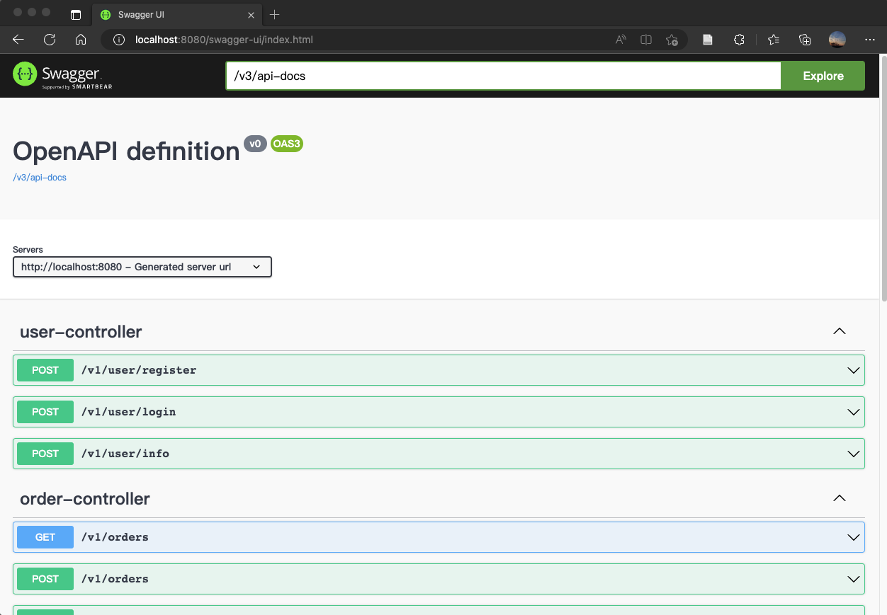
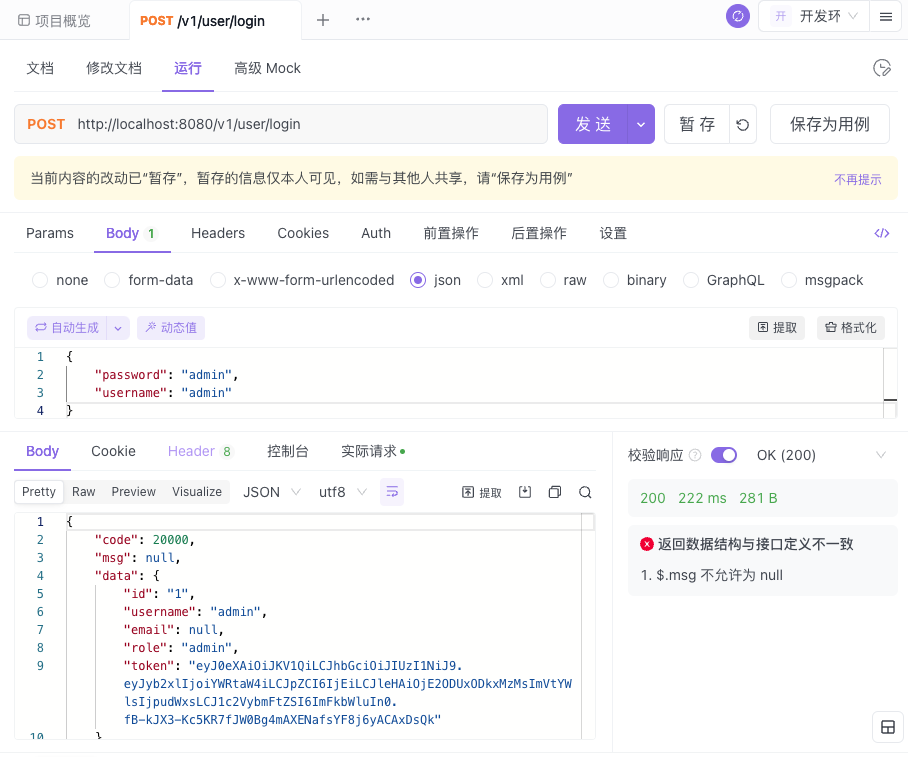
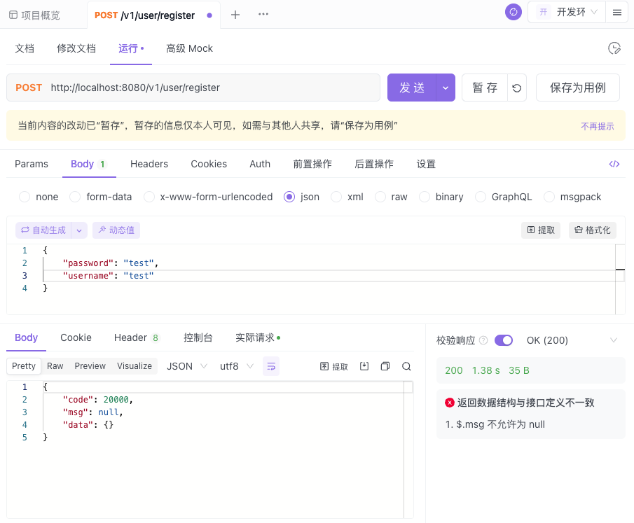
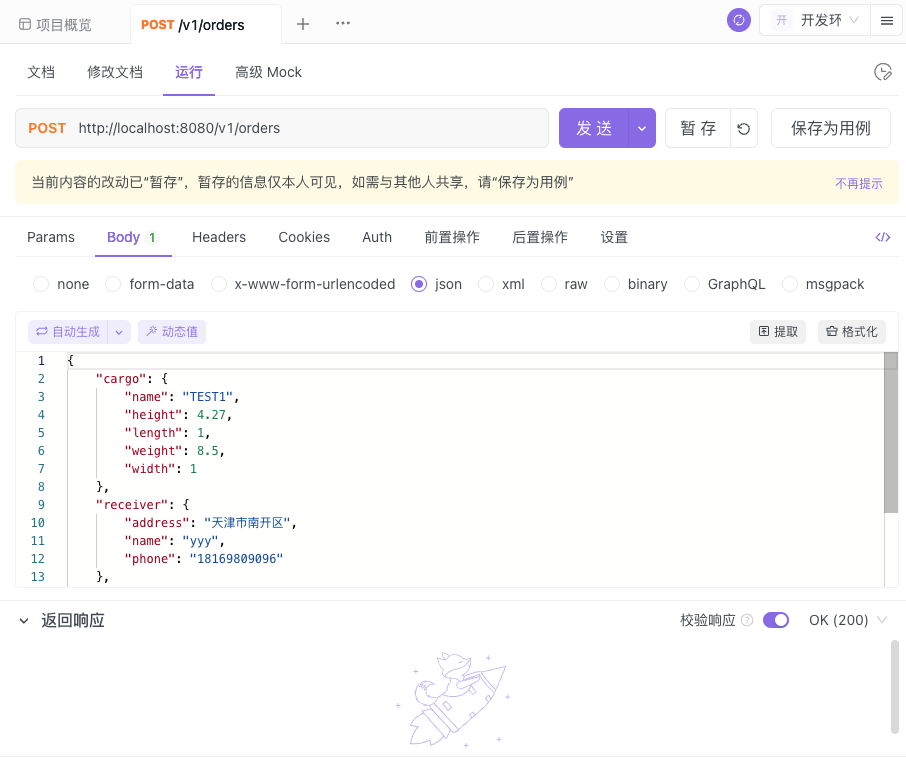
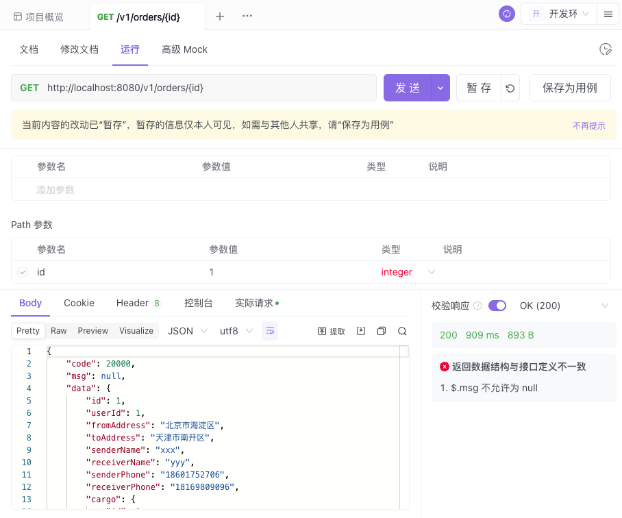
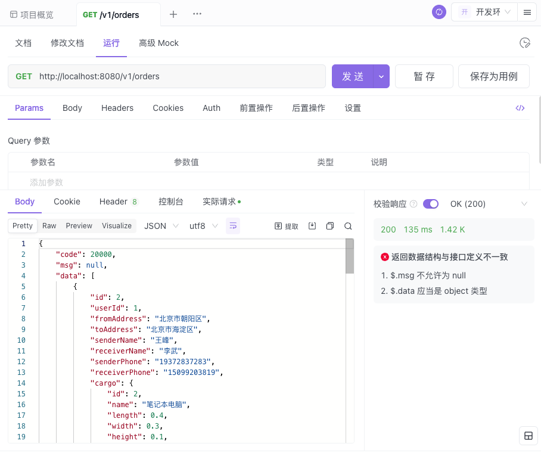
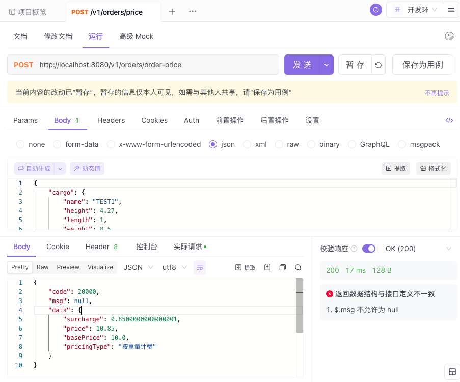
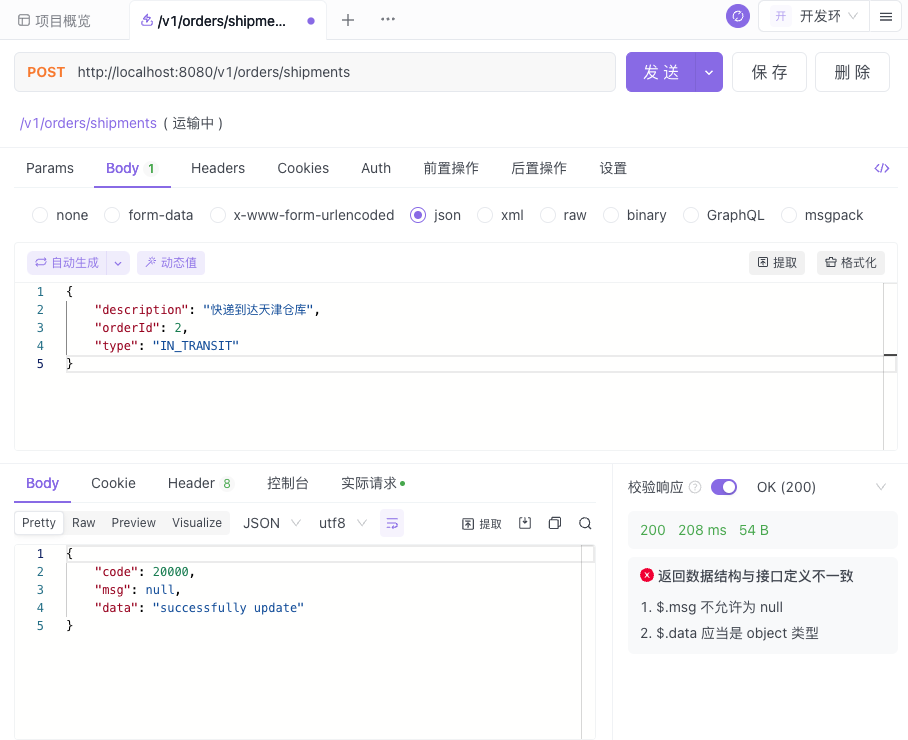

# the Shipment Service Server
This is the personal project for the semester practice.
It uses Spring Boot framework, MySQL database and Spring Data JPA.
JWT is used for authentication.
The openapi doc is enabled in the project, you can access it by http://localhost:8080/swagger-ui.html

# Project Snapshot
## Swagger UI

## APIs and Running Results in Apifox
### login

### create an account

### create order

### get order

### get all orders

### retreive order's price
Currently, we only calculate the price by the weight of the order. The base price is 10, and the price per kilogram is 0.1. The distance of the order is not considered.

### update order shipment
An order has 3 status: PENDING, DELIVERING, DELIVERED. And it can have many shipment records. An shipment record has 4 status: ORDER, PROCESSING, IN_TRANSIT and DELIVERED. The status of the order is determined by the status of the last shipment record. For example, if the last shipment record is IN_TRANSIT, then the order's status is DELIVERING. If the last shipment record is DELIVERED, then the order's status is DELIVERED.
